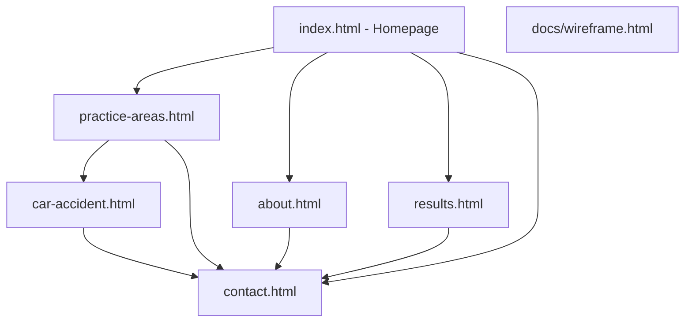
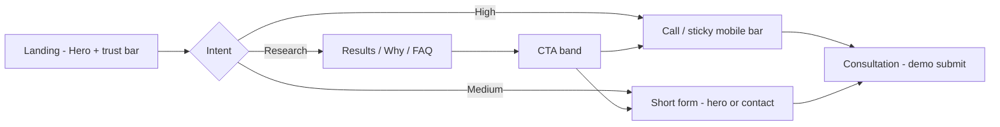

# Hartwell Injury Law - Project Workflow

Portfolio sample: wireframe → design system → multi-page build → demo.

---

## Site map



---

## Visitor conversion workflow



| Stage | Goal | Primary UI |
|-------|------|------------|
| 0–3 sec | Trust + clarity | Headline, location, dual CTA, trust metrics |
| 3–30 sec | Reassurance | Attorney visual, form, star rating |
| Scroll | Proof | Results cards, testimonials, badges |
| Consider | Differentiation | Why us, practice areas, process |
| Decide | Action | FAQ, final CTA, phone, form |

---

## Build phases (this repo)

| Phase | Deliverable | Status |
|-------|-------------|--------|
| 1 | Wireframe (`docs/wireframe.html`) | Done |
| 2 | Design tokens + components (`css/styles.css`) | Done |
| 3 | Homepage + conversion UX | Done |
| 4 | Shared chrome + inner pages | In progress |
| 5 | Polish (motion, active nav, favicon) | In progress |

---

## Page responsibilities

| Page | Audience job | Main CTA |
|------|----------------|----------|
| **Home** | Full funnel in one scroll | Free case review |
| **About** | Humanize firm, values | Meet the team → contact |
| **Practice Areas** | Route to right case type | Area cards → child or contact |
| **Car Accident** | SEO + deep trust for one niche | Case review form |
| **Results** | Outcomes + disclaimers | Discuss similar case |
| **Contact** | Map, hours, single form | Submit / call |

---

## Tech workflow (local dev)

```bash
cd "sample website for personal injury lawyer"
npx --yes serve .
```

1. Open `http://localhost:3000` - homepage  
2. Open `http://localhost:3000/docs/wireframe.html` - wireframes  
3. Test mobile bar, forms, FAQ, nav across pages  

**No build step** - static HTML/CSS/JS for fast portfolio demos.

---

## Handoff to real client

1. Replace fictional copy, phone, address  
2. License attorney photography  
3. Connect forms → CRM (HubSpot, Lawmatics, etc.)  
4. Add live chat widget on `.chat-placeholder`  
5. Deploy (Netlify, Vercel, Cloudflare Pages)  
6. Add analytics + call tracking  

---

## File structure

```
/
├── index.html
├── about.html
├── practice-areas.html
├── car-accident.html
├── results.html
├── contact.html
├── css/
│   ├── styles.css
│   ├── pages.css
│   └── wireframe.css
├── js/
│   ├── site-chrome.js
│   └── main.js
├── assets/
│   └── favicon.svg
└── docs/
    ├── wireframe.html
    └── workflow.md
```
